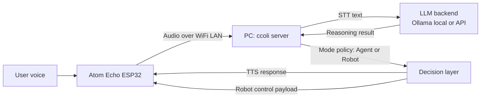

# ccoli


`ccoli` is a voice-first Arduino + Python assistant that lets you talk to an **Atom Echo ESP32** device and have a **PC-hosted server** handle speech, reasoning, and responses.

It is built for maker-friendly local experiments with:
- STT (Speech-to-Text)
- LLM-based reasoning (local Ollama or external API)
- TTS (Text-to-Speech)
- Device-side actions (voice playback today, robot actions in progress)


## Project Status

- **Agent mode**: Available now
- **Robot mode**: In development

Robot mode is intended for servo/display style actions and is controlled by feature flags in server config.

## At a Glance

### What you need

| Component | Purpose |
|-----------|---------|
| **PC** (Windows/Mac/Linux) | Runs the `ccoli` server, handles STT/LLM/TTS |
| **Atom Echo ESP32 module** | Captures voice input and plays audio responses |
| **Same local Wi-Fi network** | Connects the PC and Atom Echo |

```text
[PC]
  ├─ Run ccoli server
  └─ Upload firmware via Arduino IDE or Arduino CLI

[Atom Echo ESP32 module]
  └─ Captures voice and plays responses
```

### How the system works

1. User speaks to Atom Echo.
2. Atom Echo sends audio over local Wi-Fi to the PC server.
3. Server performs STT.
4. Server sends recognized text to an LLM backend (Ollama local model or API model).
5. Depending on mode (agent or robot), server selects response/action policy.
6. Server returns output to Atom Echo:
   - TTS audio response (agent flow)
   - or control payload for robot actions (robot flow, in progress)
7. Atom Echo executes playback and/or device action.

### Connection Diagram



## Quick Start

### Step 1. Install dependencies

```bash
pip install -r server/requirements.txt
pip install -e .
```

### Step 2. Configure Wi-Fi and server port

```bash
ccoli config wifi <SSID> password <PASSWORD> port <PORT> [mode wifi|wired]
```

Example:

```bash
ccoli config wifi MyHomeWiFi password MySecretPass port 5001
```

This updates both `server/config.yaml` and `arduino/atom_echo_m5stack_esp32_ino/device_secrets.h` automatically.

Then set `SERVER_IP` in `arduino/atom_echo_m5stack_esp32_ino/device_secrets.h` to your PC's local IP address.

### Step 3. Flash Atom Echo firmware

Open the sketch below in Arduino IDE (or use Arduino CLI) and upload to your Atom Echo:

- `arduino/atom_echo_m5stack_esp32_ino/atom_echo_m5stack_esp32_ino.ino`

Make sure `device_secrets.h` exists in the same directory before building.

### Step 4. Start the server

```bash
ccoli start
```

That's it — speak to the Atom Echo and the server will respond with voice.

## Optional Configuration

### LLM provider (Ollama / Gemini / Claude / ChatGPT)

Default provider is Ollama (runs locally, no API key needed). Switch provider and model from CLI:

```bash
ccoli config llm --provider ollama --model qwen3:8b
ccoli config llm --provider gemini --model gemini-1.5-flash --api-key <GEMINI_API_KEY>
ccoli config llm --provider claude --model claude-3-5-haiku-latest --api-key <ANTHROPIC_API_KEY>
ccoli config llm --provider chatgpt --model gpt-4o-mini --api-key <OPENAI_API_KEY>
```

When Ollama is selected, `ccoli` automatically installs Ollama if missing, starts the server, and pulls the selected model.

### Integrations (weather / search / calendar / notify / maps)

```bash
# List all integrations and their status
ccoli config integration list

# Set up weather integration
ccoli config integration set weather --api-key <WEATHER_API_KEY>
ccoli config integration enable weather
ccoli config integration test weather

# Set up Google Calendar integration
ccoli config integration set calendar-google \
  --client-id <GOOGLE_CLIENT_ID> \
  --client-secret <GOOGLE_CLIENT_SECRET> \
  --refresh-token <GOOGLE_REFRESH_TOKEN>
ccoli config integration test calendar-google
```

If a required key is missing, the test command will tell you exactly what to set:

```bash
$ ccoli config integration test weather
error: missing env key `WEATHER_API_KEY`. run `ccoli config integration set weather --api-key ...`
```

### Voice ID

Manage speaker recognition from CLI:

```bash
ccoli config voice-id status
ccoli config voice-id enable
ccoli config voice-id threshold --value 0.72
ccoli config voice-id delete --user <USERNAME>
ccoli config voice-id disable
```

You can also control Voice ID at runtime via voice commands:

```text
@@<USERNAME> register voice
@@enable voice recognition
@@<USERNAME> delete voice
@@disable voice recognition
```

## Testing

### Docker (recommended)

Run the full test suite in a reproducible Docker environment:

```bash
docker compose -f docker/docker-compose.test.yml up --build --abort-on-container-exit --exit-code-from server-test
```

The `server-test` container runs all unit, integration, CLI, and scenario tests from `server/tests`.

Optional helper script:

```bash
./scripts/run_docker_tests.sh
```

### CI (GitHub Actions)

If Docker is unavailable locally, the same tests run on GitHub Actions:

- Workflow: `.github/workflows/docker-tests.yml`
- Triggers: `pull_request`, `push(main)`, `workflow_dispatch`

## CLI Commands

| Command | Description |
|---------|-------------|
| `ccoli start` | Start the server |
| `ccoli start --port 5002` | Start with a temporary port override |
| `ccoli config wifi <SSID> password <PASS> port <PORT>` | Configure Wi-Fi/port for server + firmware |
| `ccoli config llm --provider <name> [--model <m>] [--api-key <k>]` | Set LLM provider and model |
| `ccoli config integration <list\|set\|enable\|disable\|test> ...` | Manage integration credentials |
| `ccoli config voice-id <status\|enable\|disable\|delete\|threshold> ...` | Manage Voice ID settings |

## Repository Layout

```text
.
+-- arduino/
|   +-- atom_echo_m5stack_esp32_ino/
|       +-- atom_echo_m5stack_esp32_ino.ino
|       +-- config.h
|       +-- config.h.example
|       +-- device_secrets.h.example
+-- ccoli/
|   +-- cli.py
+-- docs/
|   +-- API.md
|   +-- PROTOCOL.md
|   +-- PRD.md
|   +-- AGENT_FEATURE_PLANNING.md
|   +-- assets/
|       +-- ccoli-logo.svg
|       +-- ccoli-character.svg
+-- server/
|   +-- server.py
|   +-- config.yaml
|   +-- src/
+-- QUICKSTART.md
```

## Configuration

- Server defaults: `server/config.yaml`
- Environment overrides: `server/.env` (see `server/env.example`)
- Robot mode feature gate:
  - `server/config.yaml` → `features.robot_mode_enabled`
  - default: `false`

## Security Notes

- Never commit real credentials in firmware files.
- Store local secrets in `arduino/atom_echo_m5stack_esp32_ino/device_secrets.h` (git-ignored by default).

## Documentation

- Quick onboarding: `QUICKSTART.md`
- Server module map: `docs/API.md`
- Binary protocol details: `docs/PROTOCOL.md`
- Product requirements: `docs/PRD.md`
- Execution planning: `docs/AGENT_FEATURE_PLANNING.md`

## Codex Superpowers Setup

This project uses the [obra/superpowers](https://github.com/obra/superpowers) workflow. Codex auto-discovers skills from `~/.agents/skills/`. Install with:

```bash
./scripts/setup_codex_superpowers.sh
```

After installation, restart Codex to activate TDD, brainstorming, writing-plans, and other skills.

## Planning/PRD Templates

- PRD template: `docs/PRD_TEMPLATE.md`
- Planning template: `docs/PLANNING_TEMPLATE.md`
- Feature planning board: `docs/AGENT_FEATURE_PLANNING.md`

## Mock Services

```bash
docker compose -f docker/docker-compose.mock-services.yml up
```

## Telegram Channel

Operations guide: `docs/TELEGRAM_CHANNEL_GUIDE.md`

## License

CC BY-NC 4.0. Commercial use requires prior written permission. See `LICENSE`.
