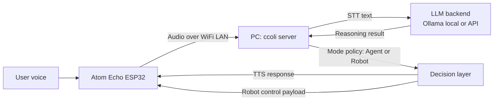

# ccoli


`ccoli` is a voice-first Arduino + Python assistant that lets you talk to an **Atom Echo ESP32** device and have a **PC-hosted server** handle speech, reasoning, and responses.

It is built for maker-friendly local experiments with:
- STT (Speech-to-Text)
- LLM-based reasoning (local Ollama or external API)
- TTS (Text-to-Speech)
- Device-side actions (voice playback today, robot actions in progress)


## Project Status

- **Agent mode**: Available now
- **Robot mode**: In development

Robot mode is intended for servo/display style actions and is controlled by feature flags in server config.

## At a Glance

### What you need

- **PC** (runs `ccoli` server and uploads firmware)
- **Atom Echo ESP32 module**
- Same local Wi-Fi network for both PC and Atom Echo

```text
[PC]
  ├─ Run ccoli server
  └─ Upload firmware via Arduino IDE or Arduino CLI

[Atom Echo ESP32 module]
  └─ Captures voice and plays responses
```

### How the system works

1. User speaks to Atom Echo.
2. Atom Echo sends audio over local Wi-Fi to the PC server.
3. Server performs STT.
4. Server sends recognized text to an LLM backend (Ollama local model or API model).
5. Depending on mode (agent or robot), server selects response/action policy.
6. Server returns output to Atom Echo:
   - TTS audio response (agent flow)
   - or control payload for robot actions (robot flow, in progress)
7. Atom Echo executes playback and/or device action.

### Project Cartoon Overview

The following cartoon summarizes the end-to-end interaction flow of `ccoli` from voice input to AI processing and multimodal output:


### Connection Diagram



## Quick Start

### 1) Install dependencies

```bash
pip install -r server/requirements.txt
pip install -e .
```

### 2) Configure Wi-Fi, password, and port

```bash
ccoli config wifi <WiFi Name> password <password> port <port> [mode wifi|wired]
```

Example:

```bash
ccoli config wifi MyHomeWiFi password MySecretPass port 5001
```

Compatibility alias is also supported:

```bash
colli config wifi MyHomeWiFi password MySecretPass port 5001
```

This command updates:
- `server/config.yaml` (`server.port`)
- `arduino/atom_echo_m5stack_esp32_ino/device_secrets.h` (`SSID`, `PASS`, `SERVER_PORT`)

Then set `SERVER_IP` in `arduino/atom_echo_m5stack_esp32_ino/device_secrets.h` to your PC IP.

### 3) Start server

```bash
ccoli start
```

Optional port override for one run:

```bash
ccoli start --port 5002
```

### 3-1) Configure LLM provider (Ollama/Gemini/Claude/ChatGPT)

Default provider is Ollama. You can switch provider and model from CLI:

```bash
ccoli config llm --provider ollama --model qwen3:8b
ccoli config llm --provider gemini --model gemini-1.5-flash --api-key <GEMINI_API_KEY>
ccoli config llm --provider claude --model claude-3-5-haiku-latest --api-key <ANTHROPIC_API_KEY>
ccoli config llm --provider chatgpt --model gpt-4o-mini --api-key <OPENAI_API_KEY>
```

When Ollama is selected, `ccoli` automatically:
- installs Ollama if missing,
- starts Ollama server,
- pulls the selected model.


### 3-2) Configure integrations (weather/search/calendar/notify/maps)

```bash
# 상태 확인
ccoli config integration list

# 날씨 키 등록/검증
ccoli config integration set weather --api-key <WEATHER_API_KEY>
ccoli config integration enable weather
ccoli config integration test weather

# Google Calendar 필수 값 등록
ccoli config integration set calendar-google \
  --client-id <GOOGLE_CLIENT_ID> \
  --client-secret <GOOGLE_CLIENT_SECRET> \
  --refresh-token <GOOGLE_REFRESH_TOKEN>
ccoli config integration test calendar-google
```

Failure example:

```bash
$ ccoli config integration test weather
error: missing env key `WEATHER_API_KEY`. run `ccoli config integration set weather --api-key ...`
```

### 3-3) Voice ID control (CLI helper)

```bash
ccoli config voice-id status
ccoli config voice-id enable
ccoli config voice-id threshold --value 0.72
ccoli config voice-id delete --user 홍길동
ccoli config voice-id disable
```


Voice command examples for runtime Voice ID:

```text
@@홍길동 목소리 등록
@@화자 인식 켜
@@홍길동 목소리 삭제
@@화자 인식 꺼
```

### 4) Flash Atom Echo firmware

Use:
- `arduino/atom_echo_m5stack_esp32_ino/atom_echo_m5stack_esp32_ino.ino`

Make sure `arduino/atom_echo_m5stack_esp32_ino/device_secrets.h` exists before build/upload.

## Docker Compose Test Entrypoint

Use a single test entrypoint for reproducible server/client checks:

```bash
docker compose -f docker/docker-compose.test.yml up --build --abort-on-container-exit --exit-code-from server-test
```

`server-test` 컨테이너는 `server/tests` 전체를 실행해 모듈 단위/통합/CLI/시나리오 테스트를 함께 검증합니다.

Optional helper script:

```bash
./scripts/run_docker_tests.sh
```

If Docker is unavailable in your local machine, run the same test stack on the GitHub Actions runner:

- Workflow: `.github/workflows/docker-tests.yml`
- Triggers: `pull_request`, `push(main)`, `workflow_dispatch`

## CLI Commands

- `ccoli start`
  - Starts `server/server.py`
- `ccoli start --port 5002`
  - Temporary port override for one run
- `ccoli config wifi <WiFi Name> password <password> port <port> [mode wifi|wired]`
  - Applies Wi-Fi/password/port to server + firmware secrets
- `ccoli config llm --provider <ollama|gemini|claude|chatgpt> [--model <name>] [--api-key <key>]`
  - Applies LLM provider settings and writes API key to `server/.env` for cloud providers
- `ccoli config integration <list|set|enable|disable|test> ...`
  - Manages feature integration credentials and validation
- `ccoli config voice-id <status|enable|disable|delete|threshold> ...`
  - Controls Voice ID feature flags and stored profile cleanup

## Repository Layout

```text
.
+-- arduino/
|   +-- atom_echo_m5stack_esp32_ino/
|       +-- atom_echo_m5stack_esp32_ino.ino
|       +-- config.h
|       +-- config.h.example
|       +-- device_secrets.h.example
+-- ccoli/
|   +-- cli.py
+-- docs/
|   +-- API.md
|   +-- PROTOCOL.md
|   +-- PRD.md
|   +-- AGENT_FEATURE_PLANNING.md
|   +-- assets/
|       +-- ccoli-logo.svg
|       +-- ccoli-character.svg
+-- server/
|   +-- server.py
|   +-- config.yaml
|   +-- src/
+-- QUICKSTART.md
```

## Configuration

- Server defaults: `server/config.yaml`
- Environment overrides: `server/.env` (see `server/env.example`)
- Robot mode feature gate:
  - `server/config.yaml` -> `features.robot_mode_enabled`
  - default: `false`

## Security Notes

- Never commit real credentials in firmware files.
- Store local secrets in:
  - `arduino/atom_echo_m5stack_esp32_ino/device_secrets.h`
- This file is git-ignored by default.

## Documentation

- Quick onboarding: `QUICKSTART.md`
- Server module map: `docs/API.md`
- Binary protocol details: `docs/PROTOCOL.md`
- Product requirements (single source): `docs/PRD.md`
- Execution planning: `docs/AGENT_FEATURE_PLANNING.md`


## Codex Superpowers Setup

이 프로젝트는 [obra/superpowers](https://github.com/obra/superpowers) 워크플로우를 사용합니다.
Codex는 `~/.agents/skills/`에서 스킬을 자동 발견하므로, 아래 스크립트로 설치하세요:

```bash
./scripts/setup_codex_superpowers.sh
```

설치 후 Codex를 재시작하면 TDD, brainstorming, writing-plans 등의 스킬이 자동 적용됩니다.
## License

CC BY-NC 4.0. Commercial use requires prior written permission. See `LICENSE`.


## Planning/PRD Templates

- PRD template: `docs/PRD_TEMPLATE.md`
- Planning template: `docs/PLANNING_TEMPLATE.md`
- Feature planning board: `docs/AGENT_FEATURE_PLANNING.md`

## Mock Services Template

```bash
docker compose -f docker/docker-compose.mock-services.yml up
```

## Telegram Channel MVP

운영 가이드: `docs/TELEGRAM_CHANNEL_GUIDE.md`
