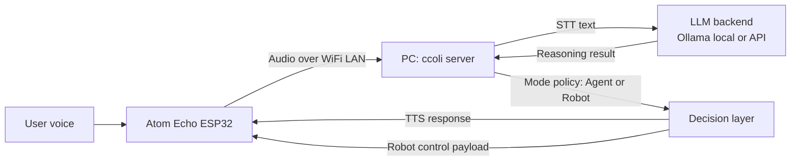

# ccoli


`ccoli` is a voice-first Arduino + Python assistant that lets you talk to an **Atom Echo ESP32** device and have a **PC-hosted server** handle speech, reasoning, and responses.

It is built for maker-friendly local experiments with:
- STT (Speech-to-Text)
- LLM-based reasoning (local Ollama or external API)
- TTS (Text-to-Speech)
- Device-side actions (voice playback today, robot actions in progress)

## Project Status

- **Agent mode**: Available now
- **Robot mode**: In development

Robot mode is intended for servo/display style actions and is controlled by feature flags in server config.

## At a Glance

### What you need

- **PC** (runs `ccoli` server and uploads firmware)
- **Atom Echo ESP32 module**
- Same local Wi-Fi network for both PC and Atom Echo

```text
[PC]
  ├─ Run ccoli server
  └─ Upload firmware via Arduino IDE or Arduino CLI

[Atom Echo ESP32 module]
  └─ Captures voice and plays responses
```

### How the system works

1. User speaks to Atom Echo.
2. Atom Echo sends audio over local Wi-Fi to the PC server.
3. Server performs STT.
4. Server sends recognized text to an LLM backend (Ollama local model or API model).
5. Depending on mode (agent or robot), server selects response/action policy.
6. Server returns output to Atom Echo:
   - TTS audio response (agent flow)
   - or control payload for robot actions (robot flow, in progress)
7. Atom Echo executes playback and/or device action.

### Connection Diagram



## Quick Start

### 1) Install dependencies

```bash
pip install -r server/requirements.txt
pip install -e .
```

### 2) Configure Wi-Fi, password, and port

```bash
ccoli config wifi <WiFi Name> password <password> port <port>
```

Example:

```bash
ccoli config wifi MyHomeWiFi password MySecretPass port 5001
```

Compatibility alias is also supported:

```bash
colli config wifi MyHomeWiFi password MySecretPass port 5001
```

This command updates:
- `server/config.yaml` (`server.port`)
- `arduino/atom_echo_m5stack_esp32_ino/device_secrets.h` (`SSID`, `PASS`, `SERVER_PORT`)

Then set `SERVER_IP` in `arduino/atom_echo_m5stack_esp32_ino/device_secrets.h` to your PC IP.

### 3) Start server

```bash
ccoli start
```

Optional port override for one run:

```bash
ccoli start --port 5002
```

### 4) Flash Atom Echo firmware

Use:
- `arduino/atom_echo_m5stack_esp32_ino/atom_echo_m5stack_esp32_ino.ino`

Make sure `arduino/atom_echo_m5stack_esp32_ino/device_secrets.h` exists before build/upload.

## CLI Commands

- `ccoli start`
  - Starts `server/server.py`
- `ccoli start --port 5002`
  - Temporary port override for one run
- `ccoli config wifi <WiFi Name> password <password> port <port>`
  - Applies Wi-Fi/password/port to server + firmware secrets

## Repository Layout

```text
.
+-- arduino/
|   +-- atom_echo_m5stack_esp32_ino/
|       +-- atom_echo_m5stack_esp32_ino.ino
|       +-- config.h
|       +-- config.h.example
|       +-- device_secrets.h.example
+-- ccoli/
|   +-- cli.py
+-- docs/
|   +-- API.md
|   +-- PROTOCOL.md
|   +-- assets/
|       +-- ccoli-logo.svg
|       +-- ccoli-character.svg
+-- server/
|   +-- server.py
|   +-- config.yaml
|   +-- src/
+-- QUICKSTART.md
```

## Configuration

- Server defaults: `server/config.yaml`
- Environment overrides: `server/.env` (see `server/env.example`)
- Robot mode feature gate:
  - `server/config.yaml` -> `features.robot_mode_enabled`
  - default: `false`

## Security Notes

- Never commit real credentials in firmware files.
- Store local secrets in:
  - `arduino/atom_echo_m5stack_esp32_ino/device_secrets.h`
- This file is git-ignored by default.

## Documentation

- Quick onboarding: `QUICKSTART.md`
- Server module map: `docs/API.md`
- Binary protocol details: `docs/PROTOCOL.md`

## License

MIT. See `LICENSE`.
